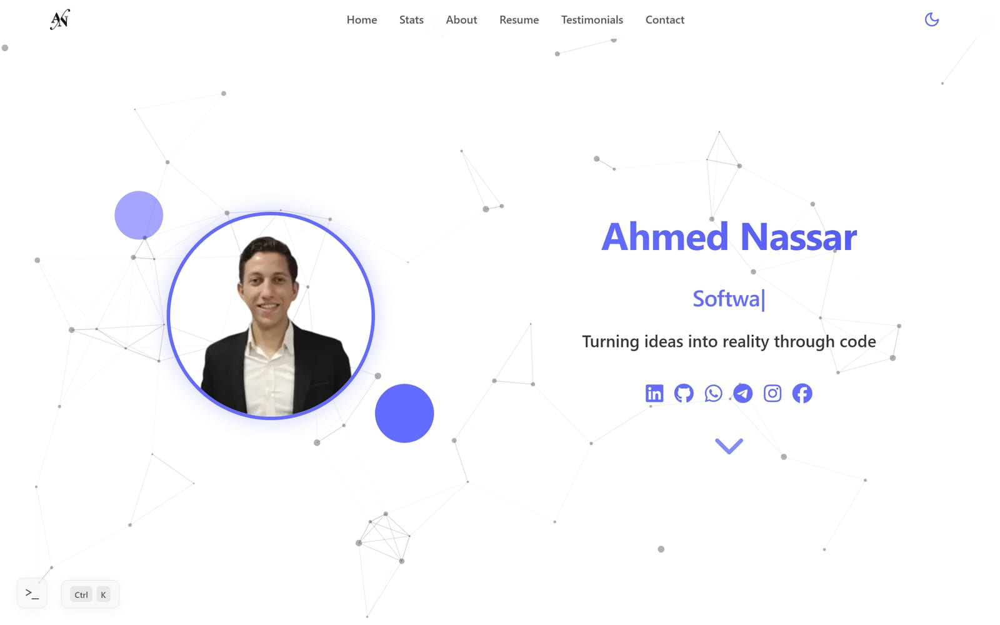
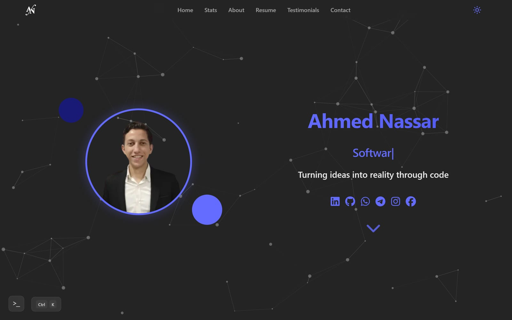
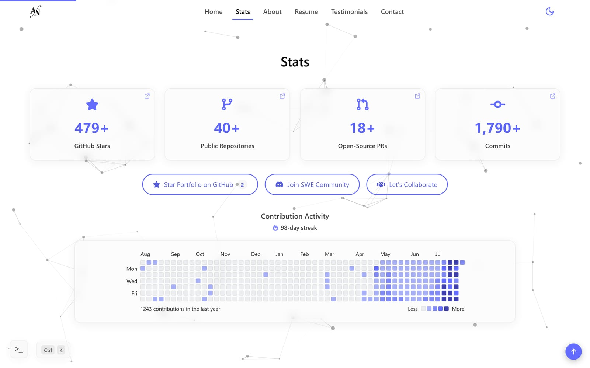
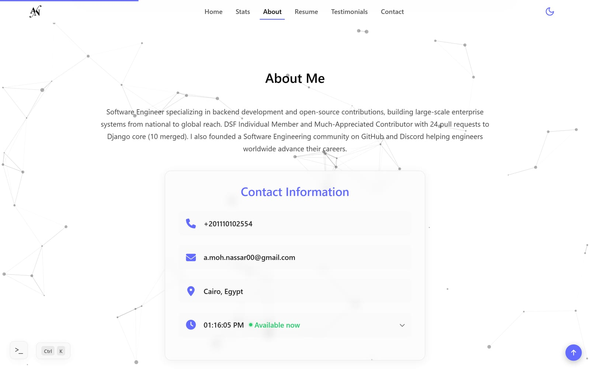
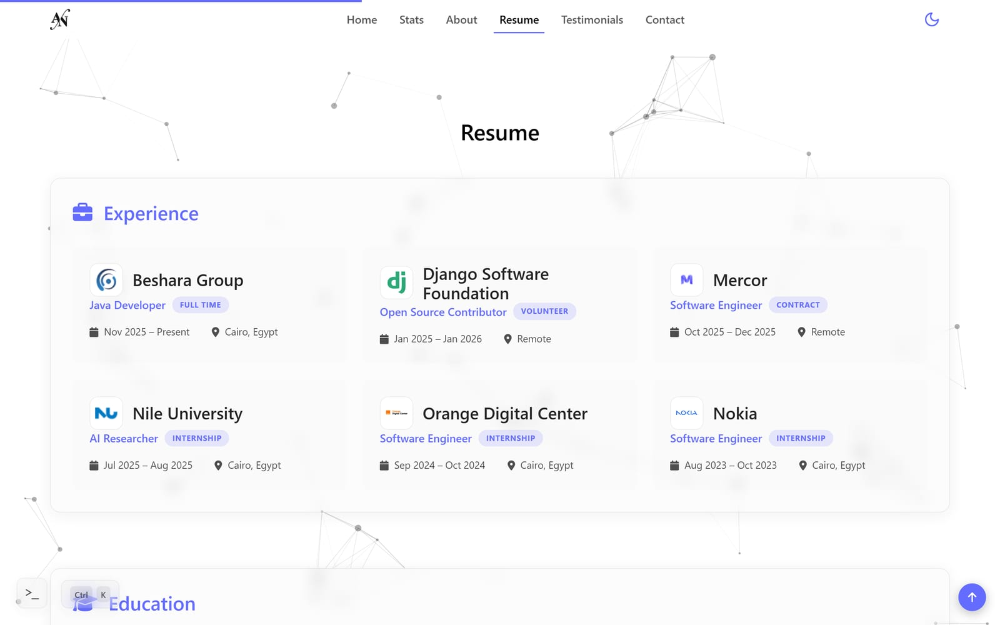
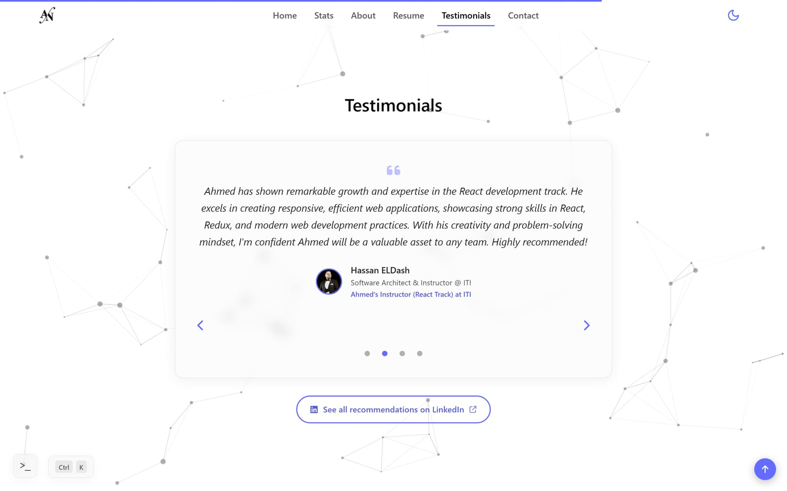
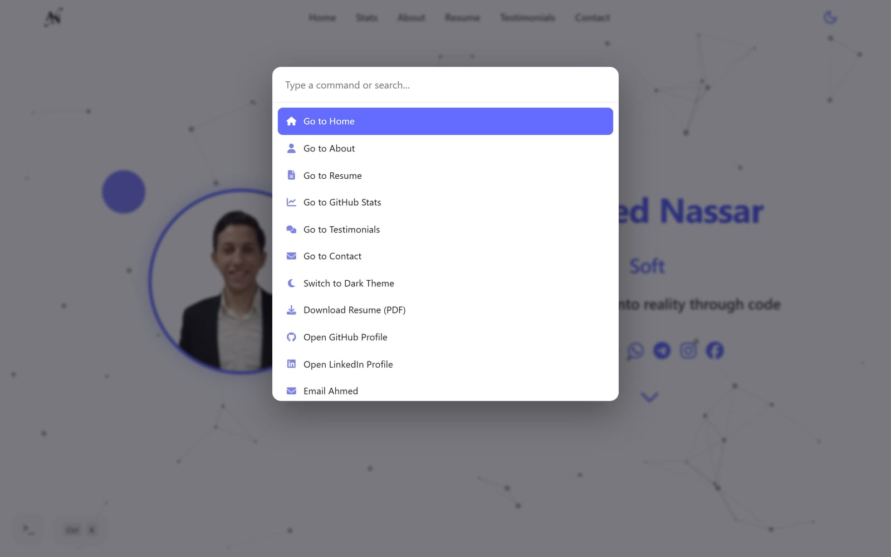
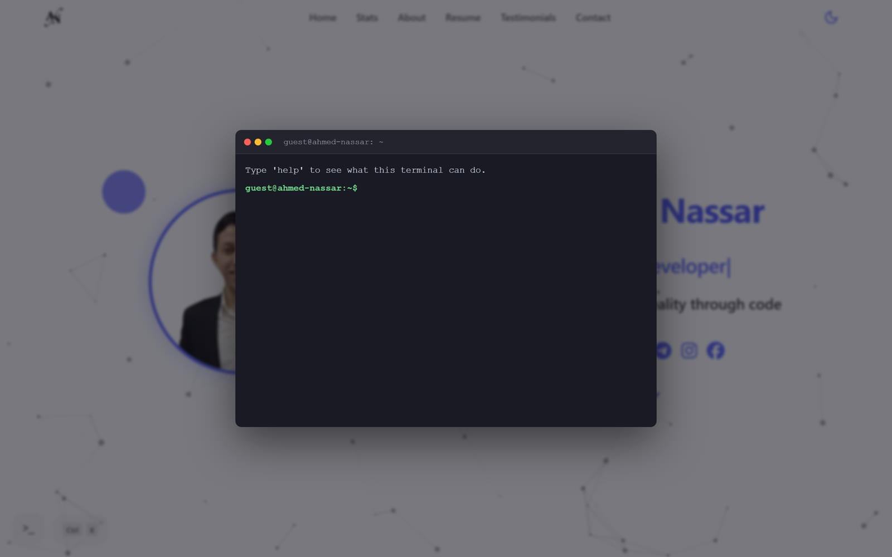
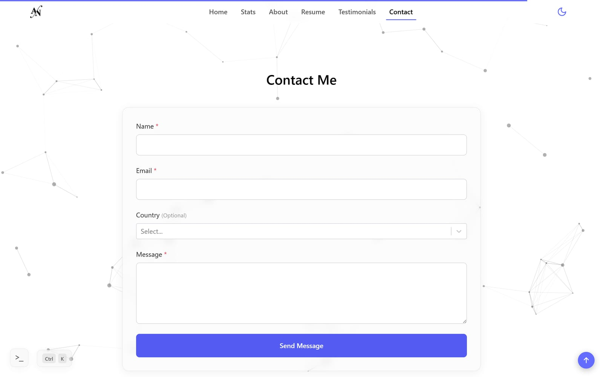

# Ahmed Nassar's Portfolio

<!-- markdownlint-disable MD033 -->

<div align="center">
    
</div>

🌟 Welcome to my **Personal Website**! Explore a world of creativity, innovation, and expertise through this **visually captivating**, **dynamic**, and **interactive** platform. Designed with cutting-edge technologies, this **fully responsive** website delivers a **seamless** and **engaging** user experience on any device. Dive in to discover my **skills**, **projects**, and **experiences**, all brought to life in a modern and immersive way 🚀

## 📖 Table of Contents

- [Demo](#-demo)
- [Screenshots](#-screenshots)
- [Technologies Used](#️-technologies-used)
- [Features](#-features)
- [Features Breakdown](#-features-breakdown)
- [Project Structure](#-project-structure)
- [Getting Started](#-getting-started)
- [Documentation](#-documentation)
- [Testing \& Quality Gates](#-testing--quality-gates)

## 🌐 Demo

You can view the live portfolio here: **[ahmednassar7.github.io](https://ahmednassar7.github.io/)**

Quick things worth trying on the live site:

- Press **Ctrl/Cmd + K** to open the [command palette](#-command-palette-🎛️).
- Click the terminal icon in the corner for a fully interactive Easter-egg [terminal](#-interactive-terminal-🖥️) (`help` for a command list).
- Toggle the moon/sun icon in the navbar to switch between light and dark themes.

## 📸 Screenshots

All screenshots below are real captures of the live app (desktop @ 1440px, mobile @ 390px), taken with a headless Chromium run against `npm run dev`.

<table>
  <tr>
    <td align="center" width="50%">
      
      <br /><sub>Home — light theme</sub>
    </td>
    <td align="center" width="50%">
      
      <br /><sub>Home — dark theme</sub>
    </td>
  </tr>
  <tr>
    <td align="center">
      
      <br /><sub>GitHub Stats — live counters & contribution heatmap</sub>
    </td>
    <td align="center">
      
      <br /><sub>About — bio & live availability widget</sub>
    </td>
  </tr>
  <tr>
    <td align="center">
      
      <br /><sub>Resume — experience, education, projects</sub>
    </td>
    <td align="center">
      
      <br /><sub>Testimonials — LinkedIn-verified recommendations</sub>
    </td>
  </tr>
  <tr>
    <td align="center">
      
      <br /><sub>Command Palette — <code>Ctrl/Cmd + K</code></sub>
    </td>
    <td align="center">
      
      <br /><sub>Interactive Terminal Easter egg</sub>
    </td>
  </tr>
  <tr>
    <td align="center">
      
      <br /><sub>Contact — Firebase + EmailJS powered form</sub>
    </td>
    <td align="center">
      
      <br /><sub>Mobile viewport (390px)</sub>
    </td>
  </tr>
</table>

## 🛠️ Technologies Used

<p align="center">
    
    
    
    
    
    
    
    
    
    
    
    
    
    
    
    
    
    
    
    
    
</p>

## ✨ Features

- `Fully Responsive Design` – Adapts seamlessly across all devices and screen sizes.
- `Command Palette` – A **Ctrl/Cmd+K** launcher for jumping to any section, toggling the theme, or opening a profile link.
- `Interactive Terminal` – A retro terminal Easter egg with real, typed commands (`whoami`, `projects`, `neofetch`, and more).
- `Interactive Background` – **Animated tsParticles** background to create a modern, immersive look.
- `Dynamic Content` – Updates with **Framer Motion** transitions and motion effects as users scroll.
- `UI/UX Design` – Followed the best practices of **UI/UX design** for a user-friendly experience.
- `Testimonials & Live GitHub Stats` – Recommender testimonials and animated, live-fetched GitHub stats (stars, repos, commits, PRs) plus a live contribution heatmap and streak counter.
- `Rotating Quotes` – Display of rotating programming quotes with **manual** and **auto-change** options.
- `Custom Scrollbar` – Unique design for better aesthetics and usability.
- `Scroll-to-Top Button` – **Smooth scrolling** and **navigation** back to the top.
- `Contact Form` – Integrated with **Firebase** and **EmailJS** to handle user inquiries.
- `PWA-Ready` – Installable, offline-capable via `vite-plugin-pwa` and a service worker.
- `Google Search Console` – Optimized **performance**, **speed**, and search engine **visibility**, **ranking**, and **indexing**.
- `Google Analytics` – Tracks **traffic**, **user behavior**, and **engagement** for data-driven decisions and improvements.
- `Modular & Scalable Code` – Built with **SCSS** and **reusable components** for easy maintenance and future scalability.
- `Performance Optimization` – Fast load times via modular (tree-shaken) Bootstrap imports, code-splitting, and image/asset optimization.
- `Automated Quality Gates` – **GitHub Actions CI** runs formatting, linting, a **Vitest** test suite, and a production build on every push and PR.
- `Cross-Browser Compatibility` – Tested and works seamlessly across all modern browsers.

## 📋 Features Breakdown

### 1. Navbar 🔽

- `Logo` – Incorporates my custom logo.
- `Smooth-Scrolling Links` – Quick links to sections (Home, About, Resume, Testimonials, Contact) with smooth scrolling.
- `Theme Toggle` – Toggle button for switching between light and dark themes.
- `Mobile-Friendly Menu` – Collapsible, mobile-responsive menu for easier navigation.
- `Scroll Progress Bar` – Visual indicator at the top of the navbar will display the scroll position.

### 2. Command Palette 🎛️

- `Quick Launcher` – Press **Ctrl/Cmd + K**, or click the on-screen trigger, to open a searchable command palette.
- `Instant Navigation` – Jump to any section, toggle the theme, download the resume, or open GitHub/LinkedIn/email — all without leaving the keyboard.
- `Keyboard-First` – Arrow keys move the selection, `Enter` runs it, `Esc` closes the palette.

### 3. Interactive Terminal 🖥️

- `Easter Egg` – A fully interactive, retro-styled terminal reachable from its own trigger button.
- `Real Commands` – Supports `help`, `whoami`, `about`, `experience`, `projects`, `skills`, `achievements`, `contact`, `resume`, `open <section>`, `theme <dark|light>`, `neofetch`, and more.
- `Command History` – Arrow-key recall of previously run commands, just like a real shell.

### 4. Home Section 🏠

- `Profile Image` – Personal image displayed on the homepage.
- `Typing Effect` – Dynamic typing string effect displaying.
- `Social Media Links` – Links to LinkedIn, GitHub, and other social profiles.
- `Scroll Arrow` – A downward arrow to help users navigate to the next section.

### 5. GitHub Stats Section 📈

- `Live Stats` – Stars, public repos, commits, and merged Django PRs fetched live from the GitHub API.
- `Animated Counters` – Numbers count up into view using Framer Motion when scrolled into view.
- `Graceful Fallback` – Falls back to last-known values if the live GitHub fetch fails.
- `Contribution Heatmap` – A live GitHub contribution calendar with a running streak counter.
- `Get Involved CTAs` – Star the portfolio repo, join the community Discord, or jump straight to the contact form.

### 6. About Section 📑

- `Personal Information` – A brief introduction and bio.
- `Contact Information` – Phone, email, and location at a glance.
- `Live Availability Widget` – An expandable clock showing Ahmed's live Cairo time with an available/away indicator; expanding it compares that against the visitor's own detected time zone and states the difference in plain English.

### 7. Resume Section 📝

- `Summary` – A concise professional summary.
- `Education` – Information about academic qualifications.
- `Experience` – Professional experiences and job history.
- `Projects` – Showcases of notable projects with descriptions and technologies used.
- `Achievements` – Awards, memberships, and other notable recognitions.
- `Skills` – A categorized list of technical skills and tools.
- `View / Download Resume` – Buttons to view or download the resume in PDF format.

### 8. Testimonials Section 💬

- `Recommendations` – Rotating carousel of testimonials from instructors, mentors, and colleagues.
- `LinkedIn Verified` – Each testimonial links to the reviewer's LinkedIn profile.
- `See All on LinkedIn` – CTA linking out to the full list of LinkedIn recommendations.

### 9. Contact Section 📬

- `Contact Form` – Collects user information including name, email, country, and message.
- `Country Dropdown` – A dropdown with flags and search functionality for selecting countries.
- `Firebase Integration` – Utilizes Firebase for storing and managing the collected messages in a secure database.
- `EmailJS Integration` – Sends the collected messages directly to my email.

### 10. Quotes Section 💬

- `Rotating Quotes` – Displays 10 rotating programming quotes that auto-update every 5 seconds.
- `Manual Quote Change` – Users can click to change the current quote.

### 11. Footer Section 📌

- `Quick Links` – Links to sections (Home, About, Resume, Contact).
- `Social Media Links` – Icons linking to social media profiles.
- `Copyright Notice` – "© Ahmed Nassar [Year] – All Rights Reserved."

### 12. Interactive Background 🌌

- `tsParticles` – Creates a visually engaging, interactive, and dynamic background with animated particles for a modern experience. Learn more about it [here](https://particles.js.org/).
- `Customizable Effects` – Easily customizable particle effects to match the website's theme and aesthetics.
- `Performance Optimized` – Ensures smooth performance without compromising the website's loading speed.
- `Responsive Design` – Adapts seamlessly to different screen sizes and devices for a consistent user experience.

### 13. Scroll-to-Top Button ⬆️

- `Scroll-to-Top Button` – Appears when the user scrolls down, enabling **quick** and **smooth scrolling** and **navigation** back to the top.
- `Customizable Design` – Easily customizable to match the website's theme and aesthetics.
- `Visibility Control` – Automatically hides when the user is at the top of the page.

### 14. Modular & Scalable Architecture 🧩

- `Component-Based Architecture` – Built with a component-based architecture, allowing easy maintenance, scalability, and clean code for future updates.
- `Reusable Components` – Components are designed to be reusable across different parts of the application.
- `Separation of Concerns` – Clear separation between different functionalities, making the codebase easier to manage and extend.
- `Optimized Dependencies` – Bootstrap is imported modularly (only the components actually used) to keep the CSS bundle lean.

### 15. Dynamic & Interactive Experience ⚙️

- `Animated Transitions` – Smooth motion effects using **Framer Motion**, **AOS**, and **CSS animations** for an engaging user experience.
- `Interactive Elements` – Elements that respond to user interactions, enhancing engagement.
- `Real-Time Updates` – Dynamic content updates without requiring a page refresh, providing a seamless experience.

### 16. UI/UX Design Principles 🎨

- `Consistency` – Uniform color schemes, typography, and spacing.
- `Simplicity` – Clean and uncluttered interface.
- `Responsive Design` – Adapts to different screen sizes.
- `Feedback` – Clear feedback for interactions.
- `Accessibility` – Designed with accessibility in mind.
- `Visual Hierarchy` – Organized content for easy navigation.
- `Smooth Navigation` – Easy-to-use navigation.
- `Performance Optimization` – Fast load times and smooth performance.

### 17. Google Analytics 📊

- `Google Analytics` – Tracks website traffic, user behavior, and engagement for data-driven decisions.
- `Real-Time Reporting` – Provides real-time data on user activity and interactions.
- `Custom Dashboards` – Allows the creation of custom dashboards to monitor specific metrics.
- `Audience Insights` – Offers detailed insights into user demographics, interests, and behavior.
- `Acquisition Reports` – Shows how users are finding and accessing the website.
- `Behavior Flow` – Visualizes the path users take through the website.
- `Event Tracking` – Monitors specific interactions such as clicks, downloads, and form submissions.

### 18. Google Search Console 🔍

- `Google Search Console` – Optimizes website **performance** and **speed** using **sitemap.xml** and best **SEO** practices to improve search visibility.
- `SEO Techniques` – Implements strategies to boost search engine **rankings**.

### 19. PWA Support 📱

- `Installable` – Can be installed to a device's home screen via `vite-plugin-pwa`.
- `Offline-Ready` – A generated service worker precaches assets for offline/repeat-visit access.
- `Web App Manifest` – Custom icons and manifest for a native-like install experience.

### 20. Continuous Integration & Testing ✅

- `GitHub Actions CI` – Every push and pull request to `main` runs formatting checks, linting, the test suite, and a production build.
- `Automated Test Suite` – **Vitest** and **React Testing Library** cover key components and utilities.
- `Pre-Commit Checks` – **Husky** and `lint-staged` auto-fix and format staged files before they're committed.

## 📁 Project Structure

```text
AhmedNassar7.github.io/
├── docs/ — Extended documentation (this file links out to it)
│   ├── ARCHITECTURE.md — Component tree, data flow & build/deploy diagrams
│   ├── DEVELOPER_GUIDE.md — Setup, scripts, conventions, testing
│   ├── USER_GUIDE.md — Visitor-facing feature walkthrough
│   └── screenshots/ — Images used in this README
├── public/ — Static assets copied as-is (favicons, PDFs, manifest)
├── src/
│   ├── assets/ — Images bundled & optimized by Vite
│   ├── components/ — One folder per feature (JSX + SCSS + tests colocated)
│   ├── data/ — resumeData.js, single source of truth for resume content
│   ├── hooks/ — Shared React hooks
│   ├── styles/ — Global SCSS entry point (main.scss)
│   ├── test/ — Vitest setup (jest-dom matchers, etc.)
│   ├── utils/ — Framework-agnostic helpers (analytics, logger, timezone…)
│   ├── App.jsx — Top-level layout & section composition
│   ├── firebase.js — Firebase app/RTDB initialization
│   └── main.jsx — React entry point
├── .github/workflows/ — ci.yml (lint/test/build) & deploy.yml (GitHub Pages)
├── vite.config.js — PWA, sitemap, compression, image optimization, chunking
└── vitest.config.js — Isolated test config (keeps prod build plugins out of tests)
```

See **[docs/ARCHITECTURE.md](./docs/ARCHITECTURE.md)** for diagrams of how these pieces fit together.

## 🚀 Getting Started

This is a quick start to get the site running locally. For prerequisites, the full environment variable reference, every npm script, coding conventions, testing, and deployment — see **[docs/DEVELOPER_GUIDE.md](./docs/DEVELOPER_GUIDE.md)**, the single source of truth for all of that.

```bash
git clone https://github.com/AhmedNassar7/AhmedNassar7.github.io.git
cd AhmedNassar7.github.io
npm install
npm run dev
```

Open [http://localhost:5173](http://localhost:5173) 🚀

## 📚 Documentation

| Document                                                 | What's in it                                                                                                                        |
| -------------------------------------------------------- | ----------------------------------------------------------------------------------------------------------------------------------- |
| **[docs/ARCHITECTURE.md](./docs/ARCHITECTURE.md)**       | System overview, component tree, contact-form data flow, and CI/deploy pipeline — all as diagrams.                                  |
| **[docs/DEVELOPER_GUIDE.md](./docs/DEVELOPER_GUIDE.md)** | Local setup, every npm script, environment variables, project conventions, and how to add a new section or test.                    |
| **[docs/USER_GUIDE.md](./docs/USER_GUIDE.md)**           | A visitor-facing walkthrough of every feature — command palette, terminal commands, theme toggle, PWA install, accessibility notes. |
| **[CONTRIBUTING.md](./CONTRIBUTING.md)**                 | How to propose changes: branching, commit style, and the checks your PR needs to pass.                                              |

## ✅ Testing & Quality Gates

Every push and pull request to `main` runs formatting checks, linting, the full **Vitest** suite, and a production build via [`.github/workflows/ci.yml`](./.github/workflows/ci.yml) — badge at the top of this file tracks that status. For how to run each of these checks locally before you push, see **[docs/DEVELOPER_GUIDE.md § Testing](./docs/DEVELOPER_GUIDE.md#testing)**.

## 🚀 Deployment

Live at **[ahmednassar7.github.io](https://ahmednassar7.github.io/)**, auto-deployed to GitHub Pages on every push to `main`. For the manual deploy path and required secrets, see **[docs/DEVELOPER_GUIDE.md § Deployment](./docs/DEVELOPER_GUIDE.md#deployment)**.

## 🤝 Acknowledgments

<p align="center">
    <a href="https://developer.mozilla.org/en-US/docs/Web/HTML" target="_blank" rel="noopener noreferrer">
        
    </a>
    <a href="https://developer.mozilla.org/en-US/docs/Web/CSS" target="_blank" rel="noopener noreferrer">
        
    </a>
    <a href="https://developer.mozilla.org/en-US/docs/Web/JavaScript" target="_blank" rel="noopener noreferrer">
        
    </a>
    <a href="https://reactjs.org/" target="_blank" rel="noopener noreferrer">
        
    </a>
    <a href="https://sass-lang.com/" target="_blank" rel="noopener noreferrer">
        
    </a>
    <a href="https://getbootstrap.com/" target="_blank" rel="noopener noreferrer">
        
    </a>
    <a href="https://www.framer.com/motion/" target="_blank" rel="noopener noreferrer">
        
    </a>
    <a href="https://vitejs.dev/" target="_blank" rel="noopener noreferrer">
        
    </a>
    <a href="https://vite-pwa-org.netlify.app/" target="_blank" rel="noopener noreferrer">
        
    </a>
    <a href="https://firebase.google.com/" target="_blank" rel="noopener noreferrer">
        
    </a>
    <a href="https://fontawesome.com/" target="_blank" rel="noopener noreferrer">
        
    </a>
    <a href="https://prettier.io/" target="_blank" rel="noopener noreferrer">
        
    </a>
    <a href="https://eslint.org/" target="_blank" rel="noopener noreferrer">
        
    </a>
    <a href="https://analytics.google.com/" target="_blank" rel="noopener noreferrer">
        
    </a>
    <a href="https://search.google.com/search-console" target="_blank" rel="noopener noreferrer">
        
    </a>
    <a href="https://particles.js.org/" target="_blank" rel="noopener noreferrer">
        
    </a>
    <a href="https://michalsnik.github.io/aos/" target="_blank" rel="noopener noreferrer">
        
    </a>
    <a href="https://www.emailjs.com/" target="_blank" rel="noopener noreferrer">
        
    </a>
    <a href="https://vitest.dev/" target="_blank" rel="noopener noreferrer">
        
    </a>
    <a href="https://testing-library.com/" target="_blank" rel="noopener noreferrer">
        
    </a>
    <a href="https://github.com/features/actions" target="_blank" rel="noopener noreferrer">
        
    </a>
</p>

## 🎯 Goals and Vision

As a passionate developer, my vision is to create scalable, efficient, and innovative software solutions that solve real-world problems. I aim to continuously improve my skills in full-stack development and contribute to the growth of the tech community by building impactful projects.

## 🌍 Contact for Freelance or Consulting

If you're interested in collaborating, hiring, or seeking consulting services, please don't hesitate to get in touch with me. I'm available for freelance work, project consultation, collaboration, and new opportunities.

<p align="center">
    <a href="https://www.linkedin.com/in/nasssar/">
        
    </a>

    <a href="https://github.com/AhmedNassar7">            </a>

    <a href="mailto:a.moh.nassar00@gmail.com">            </a>

</p>

## ⚖️ License

This project is licensed under the MIT License - see the [LICENSE](./LICENSE) file for details.

---

Thank you for visiting my portfolio! Feel free to contact me if you have any questions or inquiries.
