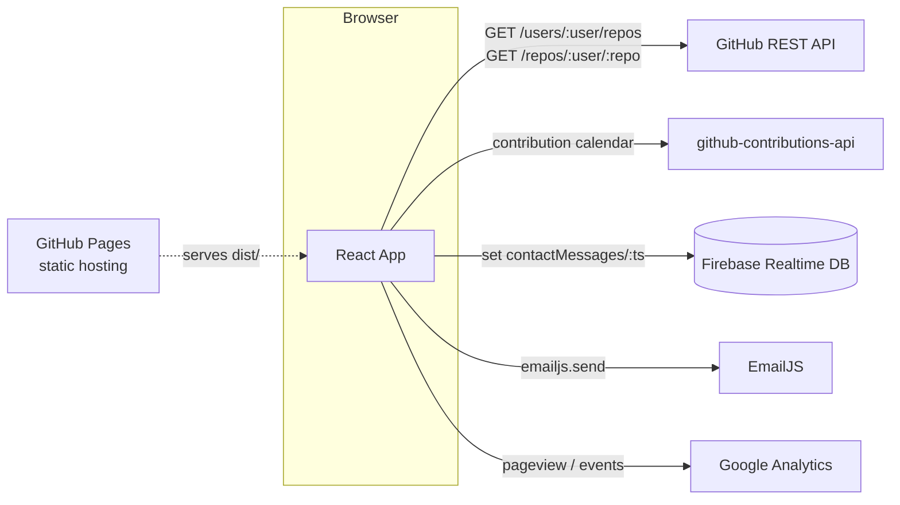
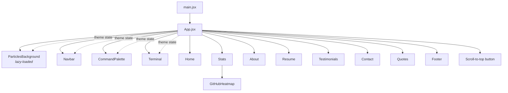
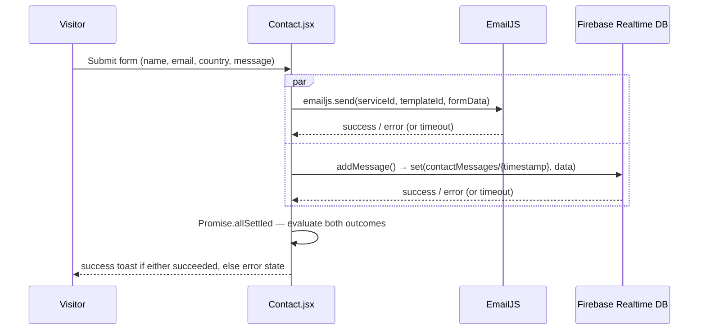
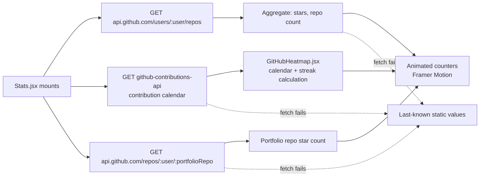
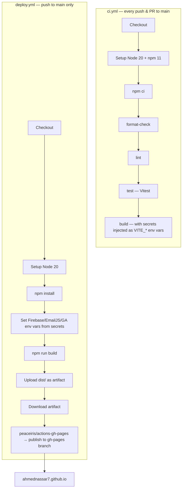

# Architecture

This document describes how the portfolio is put together: the runtime component tree, how data flows through the two integrations that do real work (the contact form and the live GitHub stats), and how a commit turns into a deployed site.

For setup instructions and day-to-day development commands, see [DEVELOPER_GUIDE.md](./DEVELOPER_GUIDE.md). For a feature walkthrough from a visitor's perspective, see [USER_GUIDE.md](./USER_GUIDE.md).

## 1. Overview

This is a **static single-page application**: a React tree rendered client-side, built by Vite, and deployed as static files to GitHub Pages. There is no application server or API of its own — the only two backends involved are third-party services the app talks to directly from the browser:

- **Firebase Realtime Database** — stores contact-form submissions.
- **EmailJS** — emails Ahmed a copy of each submission, also called directly from the browser (no backend relay).

Everything else (GitHub stats, contribution heatmap, particles background, terminal, command palette) is either a public read-only API call or purely client-side state.

## 2. Component Tree

`src/main.jsx` mounts `App`, which composes every section as a sibling under `<main>`. Sections are plain scroll targets (`<section id="...">`), not routes — navigation is scrolling, driven by `react-scroll`.

Key structural decisions:

- **No routing library for navigation.** `react-router-dom` is a dependency, but the site itself is one scrollable page — section links use `react-scroll`'s `scroller.scrollTo`, and the URL hash is updated manually (`window.history.replaceState`) so links stay shareable without a router remounting anything.
- **`theme` lives in `App.jsx`** as local state, persisted to `localStorage`, and passed down as a prop to the handful of components that need to render differently per theme (`Navbar`, `CommandPalette`, `Terminal`, `ParticlesBackground`, `Stats`). There's no context provider or global store — the prop-drilling depth is shallow enough (one level) that it isn't worth the indirection.
- **`ParticlesBackground` is the only lazy-loaded component** (`React.lazy` + `Suspense`), since `tsparticles` is one of the larger dependencies and isn't needed for first paint.
- **Resume content is data-driven.** `src/data/resumeData.js` exports `education`, `experiences`, `projects`, `achievements`, and `skills`; both `Resume.jsx` and the terminal's `experience`/`projects`/`skills`/`achievements` commands read from the same source, so the two surfaces can't drift out of sync.

## 3. Data Flow: Contact Form

`Contact.jsx` fires the EmailJS send and the Firebase write **in parallel**, not sequentially, so a slow/failed EmailJS call can't block the Firebase backup (or vice versa):

Notes:

- Both calls are wrapped in a timeout and combined with `Promise.allSettled`, so one hung request can't leave the form stuck on "Sending…" forever.
- `src/firebase.js` checks that every required `VITE_FIREBASE_*` variable is present before calling `initializeApp`/`getDatabase`. If any are missing, it logs an error and skips Firebase init entirely rather than throwing — `addMessage()` then rejects with a clear error instead of touching an uninitialized database, and the rest of the app (including the rest of the Contact form) still renders normally. See [DEVELOPER_GUIDE.md § Environment Variables](./DEVELOPER_GUIDE.md#environment-variables) for the full behavior.
- `src/firebase.js` also opens the Realtime Database's socket connection at page load (subscribing to the special `.info/connected` path) instead of waiting for the first form submission, so the connection handshake isn't on the critical path when a visitor actually hits "Send".

## 4. Data Flow: Live GitHub Stats

`Stats.jsx` fetches three independent things on mount and renders whatever resolves, falling back to last-known static numbers if a call fails (no loading spinner blocking the section):

`src/utils/streaks.js` contains the pure streak-calculation logic (kept separate from the fetching/rendering component so it's unit-testable in isolation — see `streaks.test.js`).

## 5. Build & Deployment Pipeline

Two separate GitHub Actions workflows cover CI and deployment; they run independently on every push to `main`.

- **`ci.yml`** is the quality gate: it never publishes anything, it just has to pass. It's what PRs are checked against.
- **`deploy.yml`** is independent of CI passing — it builds and publishes on every push to `main`. In practice you want `ci.yml` green before merging, since a broken build published to `deploy.yml` would take the live site down.
- Both workflows need the same set of repository secrets (`FIREBASE_*`, `VITE_EMAILJS_*`, `VITE_GOOGLE_*`) configured under **Settings → Secrets and variables → Actions** — see [DEVELOPER_GUIDE.md](./DEVELOPER_GUIDE.md#environment-variables) for the full list.
- A manual alternative to `deploy.yml` exists via `npm run deploy` (the [`gh-pages`](https://www.npmjs.com/package/gh-pages) package), which builds locally and force-pushes `dist/` to the `gh-pages` branch directly from your machine.

## 6. Build-Time Optimizations (`vite.config.js`)

The production build (not the dev server) runs a longer plugin pipeline than most Vite apps, since this is a public, SEO-sensitive, installable site:

| Plugin                           | Purpose                                                                                               |
| -------------------------------- | ----------------------------------------------------------------------------------------------------- |
| `vite-plugin-sitemap`            | Generates `sitemap.xml` for search engines.                                                           |
| `vite-plugin-compression` (×2)   | Emits pre-compressed `.gz` and `.br` variants of build output.                                        |
| `vite-plugin-image-optimizer`    | Optimizes/minifies raster images and SVGs at build time.                                              |
| `vite-plugin-html`               | Injects build-time HTML transforms (e.g. env-driven meta tags).                                       |
| `vite-plugin-pwa`                | Generates the service worker + Web App Manifest for installability/offline use.                       |
| `rollup-plugin-visualizer`       | Opens a bundle-size treemap after each build (`open: true`) — useful when chasing bundle bloat.       |
| Manual chunking (`manualChunks`) | Splits vendor code into cacheable chunks instead of one monolithic bundle.                            |
| Modular Bootstrap imports        | Only the specific Bootstrap components actually used are imported, instead of the full CSS/JS bundle. |

`vitest.config.js` is deliberately a **separate, minimal config** — it only registers the React plugin and the `@` → `src` alias, so none of the production-only plugins above (image optimization, PWA, compression) run while executing the test suite.
