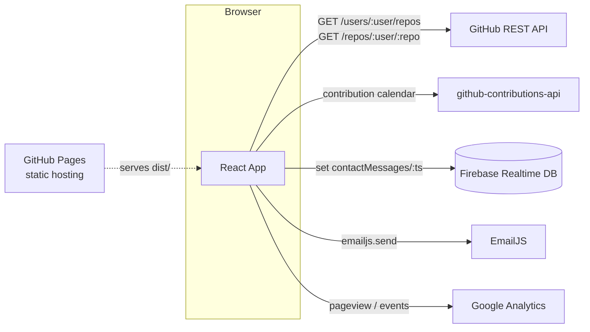
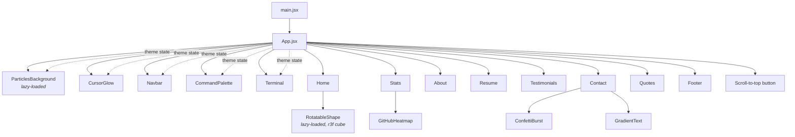
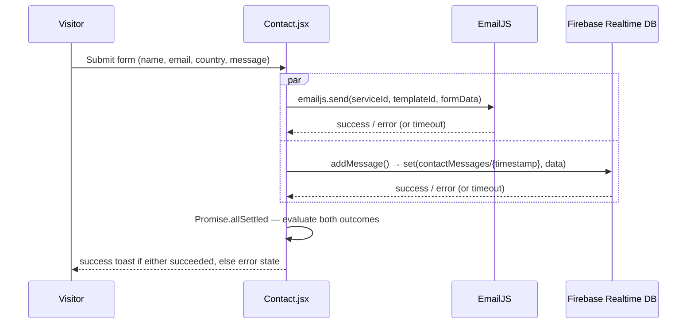
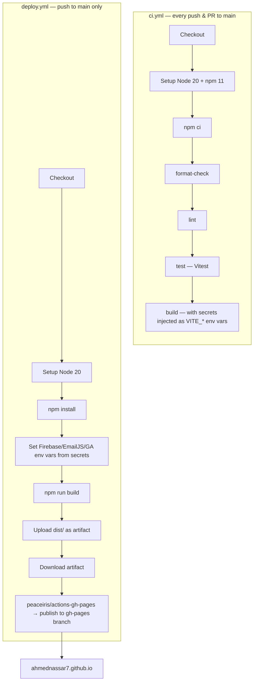

# Architecture

How the portfolio is built: the component tree, the two real data flows (contact form, GitHub stats), and the deploy pipeline.

Setup: [DEVELOPER_GUIDE.md](./DEVELOPER_GUIDE.md). Visitor-facing features: [USER_GUIDE.md](./USER_GUIDE.md).

## 1. Overview

A **static single-page app**: React, built by Vite, deployed to GitHub Pages. No app server. Two third-party backends, called directly from the browser:

- **Firebase Realtime Database** — stores contact-form submissions.
- **EmailJS** — emails Ahmed a copy of each submission.

Everything else (GitHub stats, heatmap, particles, terminal, command palette) is a public API call or client-side state.

## 2. Component Tree

`main.jsx` mounts `App`, which renders every section as a sibling under `<main>`. Sections are scroll targets (`<section id="...">`), not routes — navigation is scrolling via `react-scroll`.

Key decisions:

- **No router for navigation.** `react-router-dom` is a dependency, but the site is one scrollable page — `react-scroll` handles jumps; the URL hash updates manually (`window.history.replaceState`).
- **`theme` lives in `App.jsx`** as local state, persisted to `localStorage`, passed as a prop to the few components that need it. No context/store — one level of drilling isn't worth the indirection.
- **Two components are lazy-loaded**: `ParticlesBackground` (`tsparticles` is large and not needed for first paint) and `RotatableShape` (`three`/`@react-three/fiber` — the Home section's 3D cube). Both are also gated behind a `prefers-reduced-motion` check in their parent, so visitors who've opted out of motion never fetch either chunk.
- **`useMagneticHover`** (`src/hooks/useMagneticHover.js`) is a small shared hook — not a component — behind the magnetic pull on the Home/Footer social icons and the Contact submit button. Same gating pattern as `TiltCard`: inert on touch devices and under `prefers-reduced-motion`.
- **Resume content is data-driven.** `src/data/resumeData.js` is the single source; both `Resume.jsx` and the terminal's commands read from it.

## 3. Data Flow: Contact Form

`Contact.jsx` sends EmailJS and writes to Firebase **in parallel**, so one slow/failed call can't block the other:

- Both calls have a timeout and run through `Promise.allSettled`, so one hung request can't stick the form on "Sending…".
- `src/firebase.js` checks all `VITE_FIREBASE_*` vars before calling `initializeApp`/`getDatabase`. If any are missing, it logs and skips init; `addMessage()` rejects instead of crashing. See [DEVELOPER_GUIDE.md § Environment Variables](./DEVELOPER_GUIDE.md#environment-variables).
- `src/firebase.js` opens the Realtime Database socket at page load (via `.info/connected`), not on first submit, so the connection handshake isn't on the critical path.

## 4. Data Flow: Live GitHub Stats

`Stats.jsx` fetches three things independently on mount, falling back to last-known values if a call fails:

```mermaid
flowchart LR
    Stats[Stats.jsx mounts] --> R[GET api.github.com/users/:user/repos]
    Stats --> C[GET github-contributions-api<br/>contribution calendar]
    Stats --> P[GET api.github.com/repos/:user/:portfolioRepo]

    R --> Agg[Aggregate: stars, repo count]
    C --> Heat[GitHubHeatmap.jsx<br/>calendar + streak calculation]
    P --> Star[Portfolio repo star count]

    Agg --> Counters[Animated counters<br/>Framer Motion]
    Heat --> Counters
    Star --> Counters

    Agg -. fetch fails .-> Fallback[Last-known static values]
    C -. fetch fails .-> Fallback
    P -. fetch fails .-> Fallback
```

`src/utils/streaks.js` holds the streak logic, kept separate for unit testing (`streaks.test.js`).

## 5. Build & Deployment Pipeline

Two GitHub Actions workflows, independent of each other, on every push to `main`:

- **`ci.yml`** is the quality gate — never publishes, just has to pass. What PRs are checked against.
- **`deploy.yml`** runs regardless of CI — keep CI green before merging, or a broken build takes the live site down.
- Both need the same repository secrets (`FIREBASE_*`, `VITE_EMAILJS_*`, `VITE_GOOGLE_*`) — see [DEVELOPER_GUIDE.md](./DEVELOPER_GUIDE.md#environment-variables).
- Manual alternative: `npm run deploy` ([`gh-pages`](https://www.npmjs.com/package/gh-pages) package), builds locally and pushes to `gh-pages` directly.

## 6. Build-Time Optimizations (`vite.config.js`)

The production build runs a longer plugin pipeline than a typical Vite app:

| Plugin                         | Purpose                                            |
| ------------------------------ | -------------------------------------------------- |
| `vite-plugin-sitemap`          | Generates `sitemap.xml`.                           |
| `vite-plugin-compression` (×2) | Pre-compressed `.gz` and `.br` build output.       |
| `vite-plugin-image-optimizer`  | Optimizes images/SVGs at build time.               |
| `vite-plugin-html`             | Build-time HTML transforms (env-driven meta tags). |
| `vite-plugin-pwa`              | Service worker + manifest.                         |
| `rollup-plugin-visualizer`     | Bundle-size treemap after each build.              |
| Manual chunking                | Splits vendor code into cacheable chunks.          |
| Modular Bootstrap imports      | Only the components actually used.                 |

`vitest.config.js` is a **separate, minimal config** — React plugin and `@` alias only, so tests skip the production-only plugins above.
